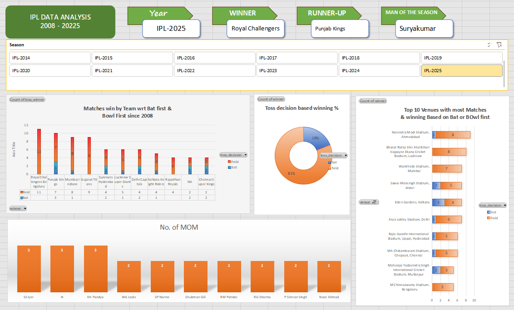

# IPL Data Analysis Dashboard (2008–2025)

## Overview

Interactive Excel dashboard built using IPL data from 2008 to 2025.

## Features

- Dynamic Season Slicer
- Winner Analysis
- Runner-Up Analysis
- Player of the Season Analysis
- Team-wise Wins Analysis
- Toss Decision Analysis
- Top 10 Venues Analysis

## Tools Used

- Excel / WPS Office
- Pivot Tables
- Pivot Charts
- Slicers
- VLOOKUP

## Dashboard Preview

## Author

G Vaibhav
